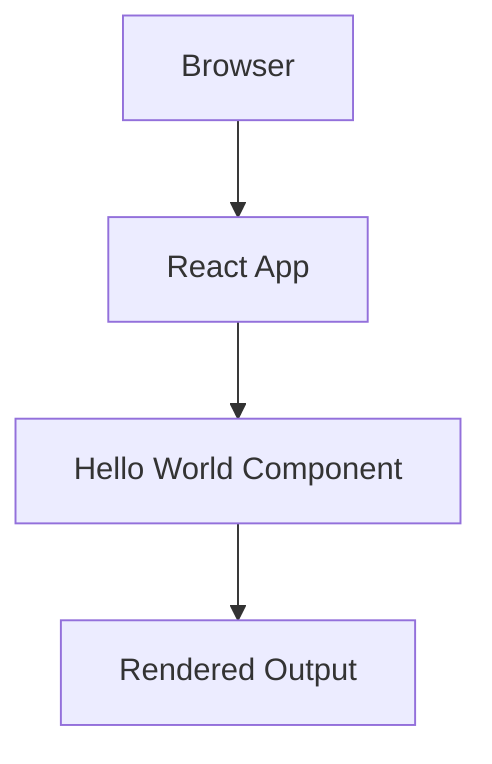

# Technical Specification: Smart Workplace React App Implementation

## Metadata

| Field | Value |
|-------|-------|
| **Issue**: | [#6](https://github.com/stillrivercode/smart-workplace/issues/6) |
| **Title**: | Smart Workplace React App Implementation |
| **Created**: | 2025-07-07 |
| **Type**: | Technical Specification |

## Table of Contents

- [Overview](#overview)
- [System Architecture](#system-architecture)
- [Detailed Design](#detailed-design)
- [Implementation Plan](#implementation-plan)
- [Testing Strategy](#testing-strategy)
- [Deployment Plan](#deployment-plan)
- [Implementation Progress](#implementation-progress)
- [Related Documents](#related-documents)
- [Issue Reference](#issue-reference)

## Overview

### Problem Statement

Create a basic Smart Workplace React application that demonstrates modern React development practices and serves as a foundation for future smart workplace development.

### Solution Summary

Implement a minimal React application using Create React App (CRA) or Vite that displays "Smart Workplace" with modern React patterns including functional components, hooks, and proper project structure.

### Goals and Objectives

- **Primary Goal**: Create a working React application that displays "Smart Workplace"
- **Secondary Goals**: 
  - Establish modern React development patterns
  - Set up proper project structure
  - Include basic testing
  - Configure linting and formatting
- **Success Criteria**: 
  - Application runs locally without errors
  - Displays "Smart Workplace" message
  - Passes all tests and linting checks

### Assumptions and Constraints

- **Assumptions**: 
  - Node.js and npm are available in the development environment
  - Modern browser support is sufficient
  - Development will follow React best practices
- **Constraints**: 
  - Must use functional components (no class components)
  - Must include TypeScript for type safety
  - Must follow existing project conventions
- **Dependencies**: 
  - Node.js 18+
  - React 18+
  - TypeScript

## System Architecture

### High-Level Architecture



### Component Overview

| Component | Responsibility | Technology |
|-----------|---------------|------------|
| App Component | Root application component | React/TypeScript |
| Greeting Component | Display smart workplace greeting message | React/TypeScript |
| Index | Application entry point | React/TypeScript |

### Data Flow

1. Browser loads the React application
2. App component renders
3. Greeting component displays the smart workplace greeting message
4. User sees "Smart Workplace" in the browser

## Detailed Design

### Core Components

#### Component 1: App Component

**Purpose**: Root component that serves as the main application container

**Responsibilities**:
- Initialize the React application
- Render the Greeting component
- Provide basic styling structure

**Interfaces**:
- Exports default App component
- No props required

#### Component 2: Greeting Component

**Purpose**: Display the "Smart Workplace" greeting message

**Responsibilities**:
- Render the greeting text
- Apply any styling for the message
- Demonstrate basic React component structure

**Interfaces**:
- Exports default Greeting component
- Optional props for customizing the greeting message

### Component Structure

```typescript
// App.tsx
interface AppProps {}

function App(): JSX.Element {
  return (
    <div className="app">
      <Greeting />
    </div>
  );
}

// Greeting.tsx
interface GreetingProps {
  message?: string;
}

function Greeting({ message = "Smart Workplace" }: GreetingProps): JSX.Element {
  return (
    <div className="greeting">
      <h1>{message}</h1>
    </div>
  );
}
```

### Styling Approach

- Use CSS Modules or styled-components for component styling
- Implement responsive design principles
- Follow consistent naming conventions

## Implementation Plan

### Phase 1: Project Setup
- [ ] Create React project structure
- [ ] Configure TypeScript
- [ ] Set up development dependencies
- [ ] Configure linting (ESLint) and formatting (Prettier)

### Phase 2: Component Development
- [ ] Create App component
- [ ] Create HelloWorld component
- [ ] Implement basic styling
- [ ] Add TypeScript interfaces

### Phase 3: Testing & Quality
- [ ] Write unit tests for components
- [ ] Configure test runner
- [ ] Set up pre-commit hooks
- [ ] Verify accessibility compliance

### Phase 4: Documentation & Deployment
- [ ] Update README with instructions
- [ ] Document component APIs
- [ ] Set up build process
- [ ] Configure deployment (if needed)

## Testing Strategy

### Unit Testing

- **Framework**: Jest + React Testing Library
- **Coverage Target**: 100% for this simple app
- **Test Categories**: 
  - Component rendering
  - Props handling
  - User interactions (if any)

### Test Cases

#### App Component Tests
- Renders without crashing
- Contains Greeting component

#### Greeting Component Tests
- Renders default message correctly
- Renders custom message when provided
- Has proper accessibility attributes

### Integration Testing

- **Full App Rendering**: Test complete app renders correctly
- **Component Integration**: Verify App and Greeting work together

## Deployment Plan

### Development Environment

- **Setup**: `npm start` for local development
- **Hot Reload**: Automatic refresh on code changes
- **Dev Tools**: React Developer Tools integration

### Build Process

- **Build Command**: `npm run build`
- **Output**: Optimized production bundle
- **Assets**: Minified CSS and JavaScript

### Deployment Options

- **Local**: File system serving
- **GitHub Pages**: Static site hosting
- **Netlify/Vercel**: Modern static hosting
- **Local Development Server**: For testing purposes

## Implementation Progress

**Instructions for the AI:** As you implement the features described in this specification, please update this section with your progress. Use checkboxes to mark completed tasks.

### Implementation Checklist
- [x] **Setup React Project**: Initialize new React app with TypeScript
- [x] **Create Components**: Implement App and Greeting components
- [x] **Add Styling**: Basic CSS styling for the components
- [x] **Setup Testing**: Configure Jest and React Testing Library
- [x] **Write Tests**: Unit tests for all components
- [x] **Configure Linting**: ESLint and Prettier configuration
- [x] **Documentation**: Update README with setup instructions
- [x] **Build Verification**: Ensure production build works correctly

### Implementation Notes
✅ **COMPLETED**: Smart Workplace React app successfully implemented with all requirements met:

- **React App**: Created in `/app` directory using Vite + TypeScript
- **Components**: Generic `Greeting` component displays "Smart Workplace" message
- **Styling**: Modern CSS with gradient background and glass-morphism effects
- **Testing**: 8 comprehensive tests covering component rendering, props, and accessibility
- **Build**: Production build tested and working correctly
- **Linting**: ESLint and Prettier configured with proper formatting rules
- **Documentation**: Complete README with setup instructions and project overview

**Key Features Implemented**:
- Modern React 18+ with functional components
- TypeScript with strict type checking
- Vitest + React Testing Library for testing
- Responsive design with modern CSS effects
- Comprehensive documentation

## Related Documents

### User Stories
- [Related user stories]

### Architecture Documents
- [System Architecture Overview](../docs/architecture.md)
- [Frontend Development Guidelines](../docs/frontend-guidelines.md)

### Operational Documents
- [Deployment Guide](../docs/deployment.md)
- [Development Setup](../README.md)

## Issue Reference

**GitHub Issue**: [#6 - Smart Workplace React App Implementation](https://github.com/stillrivercode/smart-workplace/issues/6)

### Original Description

Technical specification for implementing a basic Smart Workplace React application with modern development practices.

### Labels

- `enhancement`

### Workflow Integration

- 📝 **Manual**: Add 'ai-task' label to trigger AI implementation
- 👥 **Assignment**: Assign to team members for manual implementation
- 📋 **Tracking**: Add to project boards and milestones

---

**Generated**: 2025-07-07
**Tool**: create-spec
**Repository**: smart-workplace
**Workflow**: Unified Issue & Documentation Creation